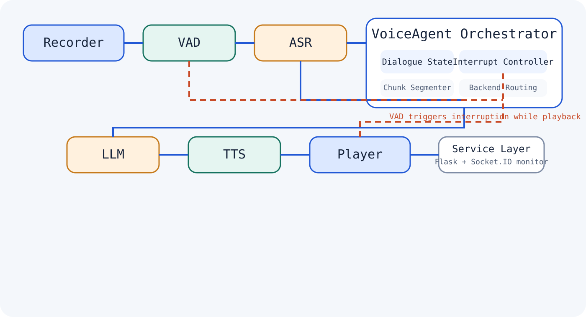

# interruptible-voice-agent

Modular voice agent prototype with interruptible dialogue flow, pluggable ASR/LLM/TTS backends, and VAD-based turn-taking control.

## Project Overview

`interruptible-voice-agent` is a public-facing engineering showcase derived from the original `bailing-main_01` research prototype.

The repository focuses on the reusable parts of the system:
- a modular speech pipeline
- interruption-aware dialogue control
- backend abstraction for ASR, LLM, TTS, and audio playback
- a thin service layer for integration and monitoring

The original structured assessment workflow is kept only as an optional application example in [examples/domain_demo.md](examples/domain_demo.md) and [examples/structured_assessment_script.json](examples/structured_assessment_script.json).

## Core Capabilities

- VAD-driven interruption handling: the orchestrator can stop active playback when new user speech is detected.
- Modular pipeline boundaries: recorder, VAD, ASR, dialogue control, LLM, TTS, and player are instantiated independently from config.
- Pluggable backends: the showcase includes interchangeable backends for `ASR`, `LLM`, `TTS`, `VAD`, and playback.
- Streaming-friendly reply path: LLM output is segmented into speakable chunks before synthesis and playback.
- Service integration: a small Flask-SocketIO monitor exposes timeline events for messages, interruptions, and backend status.

## System Architecture

The system is documented in [docs/architecture.md](docs/architecture.md).



At a high level:
1. audio enters through a recorder or browser bridge
2. VAD decides whether user speech is active and whether an interruption should be triggered
3. ASR converts finalized user audio into text
4. `VoiceAgent` maintains dialogue state and streams the request through the selected LLM backend
5. output text is segmented for TTS, synthesized incrementally, and sent to the selected player backend

## What I Built / My Contributions

- Reframed the original research codebase into a smaller public showcase that highlights architecture instead of domain-specific workflow.
- Preserved the core speech-agent composition model while removing internal materials, local artifacts, private config, and hard-coded credentials.
- Reworked the primary path around a cleaner `VoiceAgent` orchestrator in [bailing/voice_agent.py](bailing/voice_agent.py).
- Kept interruption logic as a first-class engineering concern rather than a demo-only behavior.
- Added a minimal monitoring server in [server/server.py](server/server.py) to show how the engine can plug into a UI or system integration layer.

## Quickstart

```bash
python -m venv .venv
source .venv/bin/activate
pip install -r requirements.txt
cp .env.example .env
python main.py --config config/config.yaml --no-speak
```

Notes:
- The default config is safe for inspection and uses `DummyLLM` plus `NoopPlayer`.
- To test a real hosted model, switch `selected_module.LLM` in [config/config.yaml](config/config.yaml) to `OpenAIChatLLM`.
- To test a local model, switch it to `OllamaLLM`.
- To enable audio playback, remove `--no-speak` and choose `CommandPlayer` or `PygameSoundPlayer`.

## Start Here

- Read [docs/architecture.md](docs/architecture.md) for the design overview.
- Open [bailing/voice_agent.py](bailing/voice_agent.py) for the core orchestration path.
- Check [config/config.yaml](config/config.yaml) to see how backend swapping is wired.
- Inspect [server/server.py](server/server.py) for the minimal service bridge.
- Review [examples/domain_demo.md](examples/domain_demo.md) if you want to see how a domain-specific interview flow can sit on top of the generic engine.

## Limitations

- This is still an engineering prototype, not a production-ready realtime speech stack.
- The default runner demonstrates orchestration and backend boundaries more than end-to-end voice UX.
- Interruption quality depends heavily on VAD thresholds, audio device behavior, and backend latency.
- No performance claims are made here beyond the implemented control flow and backend interfaces.
- The repository intentionally excludes large model weights, internal prompts, logs, certificates, and unpublished research materials.

## Collaboration

I am interested in collaboration around voice agents, speech interface architecture, interruption handling, and practical LLM system integration.

If you want to discuss architecture tradeoffs, extend the backend interfaces, or adapt this stack to a different domain, open an issue or reach out with a concrete use case.
