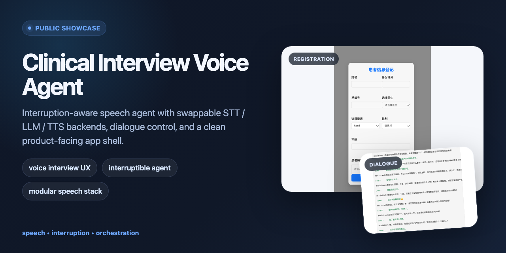
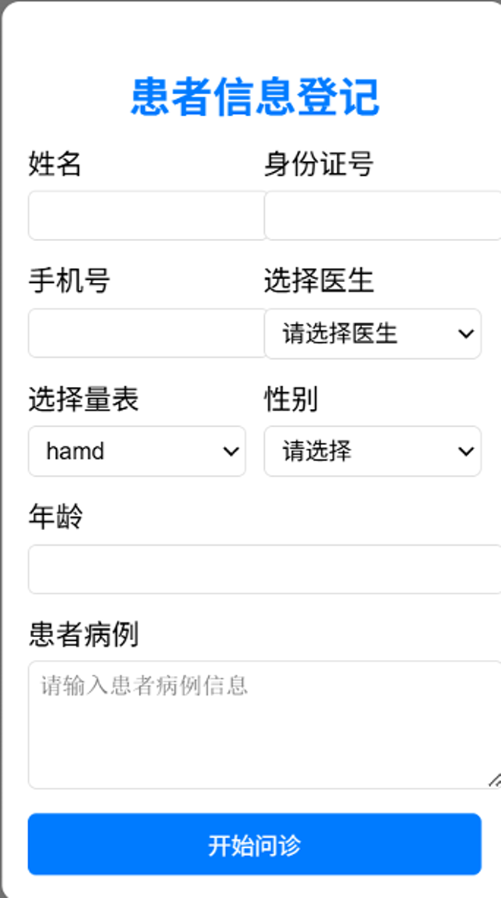
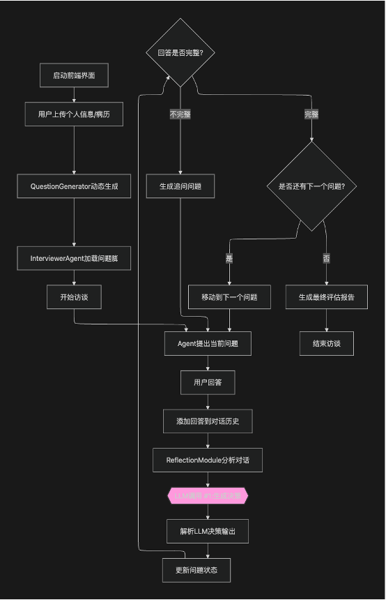

# clinical-interview-voice-agent

Public showcase of an interruptible voice-agent runtime for structured interview prototypes, with VAD-based interruption handling and modular speech backends.

> Public showcase only. This repository is not a clinical diagnostic tool, medical device, therapy product, or mental-health assessment service.



This repository highlights:
- Interruption-aware voice runtime with swappable STT / LLM / TTS / VAD / playback backends
- VAD-based interruption handling while assistant playback is active
- Lightweight scripted assessment example layered on top of the voice-agent runtime

**Demo:** [Watch 55s legacy mobile demo](docs/demo/voice-mobile-demo-55s.mp4) | [Read architecture notes](docs/architecture.md) | [See interface screenshots](#interface)

## Overview

`clinical-interview-voice-agent` is the public-facing engineering slice of a larger structured interview prototype. The code represented here is focused on the reusable voice runtime: audio input, VAD-based interruption handling, backend abstraction, dialogue state, streaming LLM output, TTS, playback, and a small scripted assessment example.

To keep the demo runnable end to end, the repository also includes the surrounding speech stack: audio input, VAD-based interruption handling, ASR / LLM / TTS backend abstraction, dialogue orchestration, and a thin service layer for UI integration.

The linked demo is a lightweight legacy mobile walkthrough. The screenshots below represent the cleaner app shell used to present the same backend capabilities as a product-facing showcase.

## Interface

| Registration | Live interview |
| --- | --- |
|  |  |

- The registration surface shows how user intake and configuration can be wrapped around the voice backend.
- The live interview view demonstrates a more inspectable product layer than raw logs or terminal output.
- Together they show how the interview engine can be presented in a product shell, rather than only through logs or terminal output.

## Speech Flow



At a high level:
1. Audio enters through a recorder or browser bridge.
2. VAD decides whether speech is active and whether playback should be interrupted.
3. ASR converts finalized user audio into text for the orchestrator.
4. [`bailing/voice_agent.py`](bailing/voice_agent.py) maintains dialogue state and streams requests through the selected LLM backend.
5. Output text is segmented, synthesized incrementally, and sent to the selected playback backend.

## What This Repository Demonstrates

- Interruptible voice-agent runtime for structured interview prototypes
- Local JSON-driven scripted assessment example
- Interruption-aware dialogue control instead of rigid turn-taking
- Clear backend boundaries across recorder, VAD, ASR, LLM, TTS, and playback
- A small service bridge in [`server/server.py`](server/server.py) for timeline inspection and UI integration

## What I Owned

- Voice-agent runtime boundaries across recorder, VAD, ASR, LLM, TTS, and playback
- VAD-triggered interruption path that stops playback and resets VAD state when user speech is detected
- Dialogue-state wrapper and streaming response path in [`bailing/voice_agent.py`](bailing/voice_agent.py)
- Lightweight scripted assessment example showing how a structured flow can sit above the runtime
- Public showcase packaging, architecture notes, screenshots, and runnable dry-run defaults

## Quickstart

```bash
python -m venv .venv
source .venv/bin/activate
pip install -r requirements.txt
cp .env.example .env
python main.py --config config/config.yaml --no-speak
```

Notes:
- The default config is safe for inspection and uses `DummyLLM` plus `NoopPlayer`.
- Switch `selected_module.LLM` in [config/config.yaml](config/config.yaml) to `OpenAIChatLLM` or `OllamaLLM` if you want a different backend.
- Remove `--no-speak` and choose an active player backend when you want to test playback.

## Start Here

- [docs/architecture.md](docs/architecture.md)
- [bailing/voice_agent.py](bailing/voice_agent.py)
- [config/config.yaml](config/config.yaml)
- [server/server.py](server/server.py)
- [examples/domain_demo.md](examples/domain_demo.md)

## Limitations

- This is still an engineering prototype, not a production-ready realtime speech stack.
- Interruption quality depends on VAD thresholds, audio device behavior, and backend latency.
- The public code does not implement a separate evaluator agent or multi-agent orchestration layer.
- The scripted assessment file is a lightweight placeholder example, not a validated clinical assessment workflow.
- The repository intentionally excludes large model weights, internal prompts, logs, certificates, and unpublished research materials.
