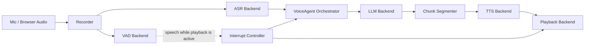
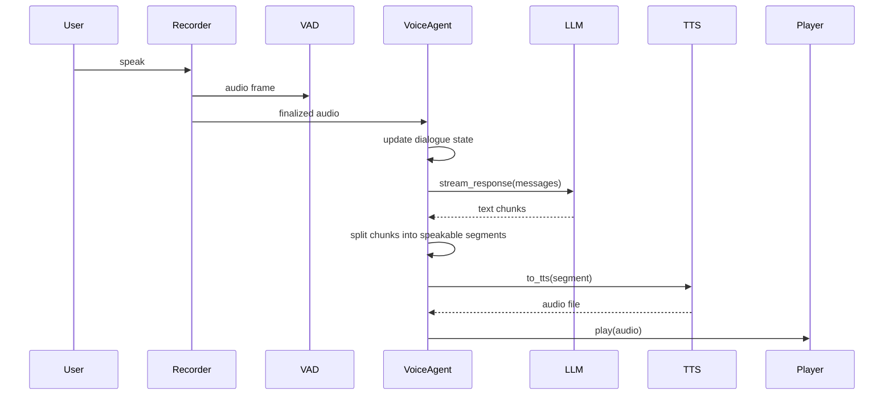

# Architecture

This repository is intentionally smaller than the original research codebase. The goal here is to expose the core runtime architecture and the structured interview workflow without preserving every internal experiment or unpublished domain asset.

## Runtime Graph



The control loop is centered on [bailing/voice_agent.py](../bailing/voice_agent.py). That file is intentionally small enough to read end to end.

## Component Boundaries

### Recorder

- Responsibility: capture input audio and push frames into a queue.
- Current implementation: `RecorderPyAudio` in [bailing/recorder.py](../bailing/recorder.py).
- Why it is separate: the capture source may be a local microphone today and a browser stream or telephony bridge tomorrow.

### VAD

- Responsibility: detect speech activity and decide whether a user is trying to take the turn back.
- Current implementations:
  - `EnergyVAD` for a lightweight local fallback
  - `SileroVAD` for a model-based path
- Public interface: `is_vad(audio_frame) -> bool`

### ASR

- Responsibility: convert finalized audio into text.
- Current implementations:
  - `StubASR` for dry-run demos
  - `FunASR` for local transcription
- Public interface: `recognizer(wav_file_path) -> (transcript, source_path)`

### Dialogue Orchestrator

- Responsibility: own the live conversation state and coordinate the turn lifecycle.
- Current implementation: `VoiceAgent`
- Core decisions handled here:
  - append user turns to dialogue state
  - stream assistant output from the selected LLM
  - split text into speakable chunks for TTS
  - stop playback when interruption conditions are met

### LLM

- Responsibility: generate the assistant reply.
- Current implementations:
  - `DummyLLM` for local inspection without credentials
  - `OpenAIChatLLM`
  - `OllamaLLM`
- Public interface: `stream_response(dialogue)`

### TTS

- Responsibility: synthesize speakable text segments into audio files.
- Current implementations:
  - `SystemTTS`
  - `GTTS`
  - `EdgeTTS`
- Public interface: `to_tts(text_segment) -> audio_path`

### Player

- Responsibility: own playback queueing and stop behavior.
- Current implementations:
  - `NoopPlayer`
  - `CommandPlayer`
  - `PygameSoundPlayer`
- Public interface:
  - `play(audio_file)`
  - `stop()`
  - `get_playing_status()`

## Turn Lifecycle



## Interrupt Path

The interruption mechanism is the main design point preserved from the original prototype.

When playback is active:
1. new input audio still flows through VAD
2. if VAD detects valid speech, `VoiceAgent.process_audio_frame()` triggers `interrupt()`
3. the player queue is cleared
4. VAD state is reset
5. the next user turn can replace the previous assistant output

That design keeps the system closer to spoken interaction norms than a strictly half-duplex request/response loop.

## Configuration Strategy

[config/config.yaml](../config/config.yaml) drives backend selection. The important idea is that switching providers does not require a rewrite of orchestration logic.

Example:

```yaml
selected_module:
  ASR: FunASR
  VAD: SileroVAD
  LLM: OpenAIChatLLM
  TTS: EdgeTTS
  Player: CommandPlayer
```

The repository defaults to safer dry-run components so the showcase stays readable and runnable without model downloads or API credentials.

## Service Layer

[server/server.py](../server/server.py) is not a product backend. It is a thin integration surface used to:
- expose a basic health endpoint
- emit timeline events
- let a UI or external process observe messages and interruption events

This keeps the repository focused on the voice-agent runtime while still showing how the core loop can connect to other systems.

## Domain-Specific Example

Structured interview and assessment flows were a core application of the original system. In this showcase, that domain layer is represented in a lighter-weight form so the agent workflow is visible without publishing internal prompts, datasets, or research artifacts.

The optional example in [examples/domain_demo.md](../examples/domain_demo.md) demonstrates how a scripted assessment workflow can sit on top of the core voice-agent architecture without redefining the lower-level audio, dialogue, or backend abstractions.
